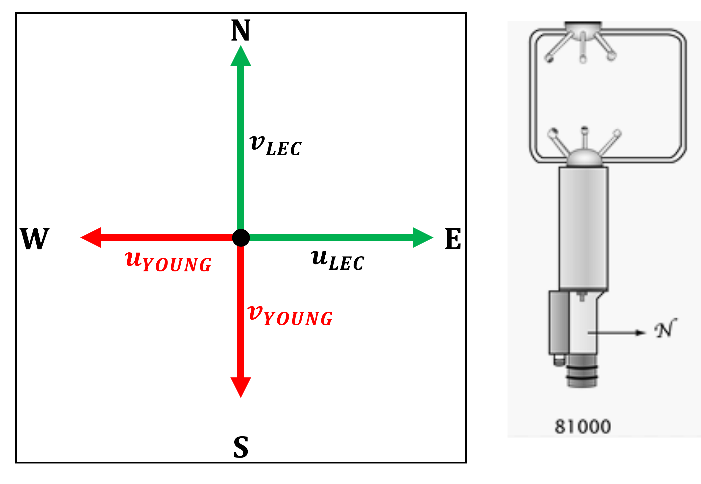
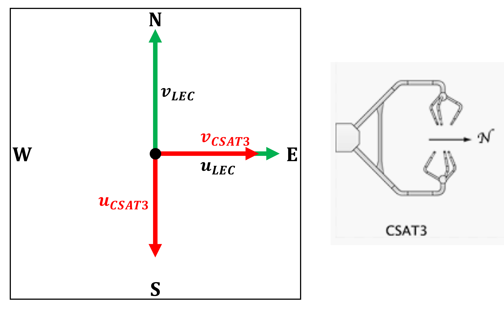

Frame rotation and wind direction
=================================

The **ProMeteo** library processes time series of the wind vector components *u*, *v*, and *w*, 
which are originally defined in the intrinsic Cartesian coordinate system of the sonic anemometer. 
These reference frames vary depending on the specific instrument model. 
A list of supported models is provided in the :ref:`welcome page <welcome-page>`.

ProMeteo provides tools to:

- rotate the reference frame to alternative coordinate systems:

  - **LEC** (Local Earth Coordinate)
  - **Streamline**, following the procedure described in [Kaimal1994]_,

- compute the **horizontal wind direction** following meteorological conventions.

Rotation to LEC reference
--------------------------

The **LEC (Local Earth Coordinate)** system is the meteorological standard. In this system:

- *u* is the *zonal* wind component. It is aligned with the x-axis, pointing from West to East, and is positive when the wind blows **from the West** (i.e., towards the East),
- *v* is the *meridional* wind component. It is aligned with the y-axis, pointing from South to North, and is positive when the wind blows **from the South**,
- *w* is the *vertical* wind component.

This transformation is handled by the function:  
``pre_processing.rotation_to_LEC_reference()``

To perform this operation, the sonic anemometer model and the azimuth angle 
(i.e., the orientation of the sensor head with respect to the geographic North) must be known.

**RM Young 81000**

The *u* and *v* components measured by the RM Young 81000 are inverted with respect to the meteorological convention. 
The *w* component correctly represents the vertical velocity.

Transformation formulas:

.. math::

   \begin{align}
   u_{LEC} &= -u_{YOUNG} \\
   v_{LEC} &= -v_{YOUNG} \\
   w_{LEC} &=  w_{YOUNG}
   \end{align}

In matrix notation:

.. math::

   \begin{bmatrix}
   u_{LEC} \\
   v_{LEC} \\
   w_{LEC}
   \end{bmatrix}
   =
   \begin{bmatrix}
   -1 & 0 & 0 \\
   0 & -1 & 0 \\
   0 & 0 & 1
   \end{bmatrix}
   \begin{bmatrix}
   u_{YOUNG} \\
   v_{YOUNG} \\
   w_{YOUNG}
   \end{bmatrix}

**Campbell CSAT3**

For the CSAT3:

- the *u* component in LEC corresponds to the negative of the instrument's *v* component,
- the *v* component in LEC corresponds to the instrument's *u* component,
- the *w* component is already aligned with the vertical.

Transformation formulas:

.. math::
    \begin{align}
   u_{LEC} = -v_{CSAT3} \\
   v_{LEC} = u_{CSAT3} \\
   w_{LEC} = w_{CSAT3}
    \end{align}

In matrix notation:

.. math::

   \begin{bmatrix}
   u_{LEC} \\
   v_{LEC} \\
   w_{LEC}
   \end{bmatrix}
   =
   \begin{bmatrix}
   0 & 1 & 0 \\
   -1 & 0 & 0 \\
   0 & 0 & 1
   \end{bmatrix}
   \begin{bmatrix}
   u_{CSAT3} \\
   v_{CSAT3} \\
   w_{CSAT3}
   \end{bmatrix}

**Azimuthal correction**

If the instrument is not oriented with its head pointing North, 
an additional rotation in the horizontal plane is required. 
This rotation is defined by the **azimuth angle** :math:`\alpha`, 
which is provided as an input to the function and defined in the ``config.txt`` 
through the ``azimuth`` parameter.

The corresponding rotation matrix is:

.. math::

   \mathbf{R}_{\alpha} =
   \begin{bmatrix}
   \cos(\alpha) & \sin(\alpha) & 0 \\
   -\sin(\alpha) & \cos(\alpha) & 0 \\
   0 & 0 & 1
   \end{bmatrix}

This matrix is applied to the wind vector to align it with the true North-oriented LEC system.

Streamline rotation
--------------------

An alternative reference frame is provided by the **physical streamline (PS) coordinate system**, 
which is defined directly by the structure of the flow itself. 
In this system, the orthonormal basis vectors :math:`(e_1, e_2, e_3)` are oriented such that:

- :math:`e_1` is tangent to the local mean streamline,
- :math:`e_2` is aligned with the principal normal to the streamline,
- :math:`e_3` is aligned with the binormal direction.

This approach follows the procedure described in [Kaimal1994]_ and 
is widely used in boundary-layer meteorology to simplify the analysis of turbulence and fluxes.

The rotation to the streamline frame is performed using the **double rotation** technique, 
which aims to orient the coordinate system such that the new velocity components satisfy the following conditions:

.. math::

   \tilde{u} \simeq |\vec{U}|, \quad \tilde{v} \simeq 0, \quad \tilde{w} \simeq 0

Here, :math:`\vec{U} = (u, v, w)` are the instantaneous wind components in the original (sensor-based) frame, 
and :math:`\tilde{\vec{U}} = (\tilde{u}, \tilde{v}, \tilde{w})` are the components in the streamline frame.

The procedure involves:

1. Computing the **mean wind vector** :math:`(\overline{u}, \overline{v}, \overline{w})` by applying a centered moving average to each component. The averaging is performed using a **sliding window**, whose length is provided by the user through the configuration parameter ``window_length_averaging`` in the file ``config.txt``.

2. Calculating the **yaw** and **pitch** angles from the mean wind components:

.. math::

   \theta = \arctan\left(\frac{\overline{v}}{\overline{u}}\right), \qquad
   \phi = \arctan\left(\frac{\overline{w}}{s}\right), \qquad
   s = \sqrt{\overline{u}^2 + \overline{v}^2}

3. Applying the following rotation matrix:

.. math::

   \begin{bmatrix}
   \tilde{u} \\
   \tilde{v} \\
   \tilde{w}
   \end{bmatrix}
   =
   \begin{bmatrix}
   \cos(\phi)\cos(\theta) & \cos(\phi)\sin(\theta) & \sin(\phi) \\
   -\sin(\theta) & \cos(\theta) & 0 \\
   -\sin(\phi)\cos(\theta) & -\sin(\phi)\sin(\theta) & \cos(\phi)
   \end{bmatrix}
   \begin{bmatrix}
   u \\
   v \\
   w
   \end{bmatrix}

This operation effectively removes the mean crosswind and vertical components from the signal, 
aligning the flow with the x-axis in the new reference frame.

In this system:

- *u* is the *streamwise* velocity component, aligned with the mean horizontal wind,
- *v* is the *crosswise* velocity component,
- *w* is the *normal-to-the-streamline* velocity component.

This transformation is applied using the function:

``pre_processing.rotation_to_streamline_reference()``

It is important to note that this rotation is data-driven and **does not** require information about the sensor model or azimuth.

Horizontal wind direction
--------------------------

Horizontal wind direction
--------------------------

In meteorology, the **horizontal wind direction** is expressed as the direction **from which** the wind is blowing, 
measured clockwise from true North. For example, a wind direction of 90° indicates wind blowing **from the East**.

In ProMeteo, the wind direction is computed starting from the **averaged horizontal components of the wind vector**, 
rather than averaging wind direction angles themselves. This distinction is crucial: wind direction is a circular quantity in the range [0°, 360°), 
and taking the arithmetic mean of such angles can lead to incorrect results. For instance, averaging 350° and 10° should yield 0°, 
but a naïve mean would result in 180°, a completely incorrect value. To avoid this, ProMeteo first averages the horizontal components 
of the wind vector and only then computes the wind direction.

The averaging operation is performed using the function ``core.running_stats()``, which applies a **centered moving average** over a time window 
whose duration is defined by the parameter ``window_length_averaging`` in the file ``config.txt``. 
This operation is performed upstream of the wind direction calculation, ensuring robustness and physical consistency.

The main script (``main.py``) chooses the method of wind direction computation, 
depending on which reference frame has been selected in the configuration file.

**Wind direction in the LEC system**

If the LEC reference frame is selected, the main script first applies a rotation of the wind vector to the LEC system 
by calling ``pre_processing.rotation_to_LEC_reference()``. This function requires the **model of the sonic anemometer** 
and the **azimuth orientation** (the heading of the instrument with respect to true North). 

Once the wind components have been rotated to the LEC system, the **horizontal components** are averaged using ``core.running_stats()``. 
Then, the wind direction is computed from the averaged components using the meteorological convention via:

.. math::

   \theta_{\text{wind}} = \left( \mathrm{deg} \left[ \arctan2(u, v) \right] + 180 \right) \bmod 360

This calculation is implemented in the function ``frame.wind_dir_LEC_reference()``, which at this stage does **not require** 
any additional information about the instrument model or azimuth, as these were used upstream in the coordinate rotation.

**Wind direction in the streamline system**

If the streamline coordinate system is chosen, the main script performs the streamline rotation using 
``frame.streamline_rotation()``. This procedure, as described above, 
does **not** require knowledge of the instrument model or orientation.

However, for consistency with the meteorological definition of wind direction (referenced to geographic North), 
the direction is computed in the **LEC frame**. The steps are as follows:

1. Apply the streamline rotation to the original time series.
2. Use ``core.running_stats()`` to compute the **averaged horizontal components** in the original (sonic) coordinate system.
3. Pass the averaged components to ``frame.wind_dir_modeldependent_reference()``, which performs a model-dependent 
   rotation to a LEC-like reference frame, 
   where the **y-axis is oriented at an azimuth angle** with respect to true North, 
   using the instrument model and azimuth.

The wind direction is then computed as:

.. math::

   \theta_{\text{wind}} = \left( \mathrm{deg} \left[ \arctan2(u_{\text{LEC}}, v_{\text{LEC}}) \right] + \alpha + 180 \right) \bmod 360

where :math:`\alpha` is the azimuth angle of the sonic head with respect to North.

**Thresholding on wind speed**

In both cases, it is possible—and recommended—to set a minimum threshold on the horizontal wind speed. 
When the magnitude of the horizontal wind vector is below this threshold, the direction is set to `NaN`, 
as it is considered not meaningful. This ensures that very low-speed or stagnant wind conditions, 
which may introduce noise or spurious directional values, are properly filtered.

Bibliography
-------------

.. [Kaimal1994] Kaimal, J. C., and Finnigan, J. J. (1994). *Atmospheric Boundary Layer Flows: Their Structure and Measurement*. Oxford University Press.
