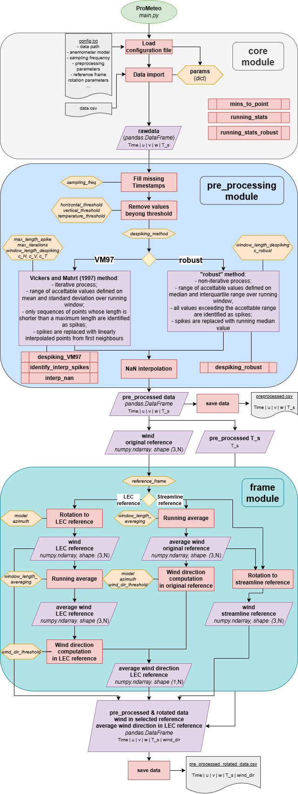

.. _welcome-page:

Welcome to ProMeteo
===================

**ProMeteo** is a Python library designed to manipulate time series data collected by sonic anemometers. 
It is structured into three modules:

- ``core`` for importing the raw data and the configuration file and computing basic statistics on sliding window.
- ``pre_processing``: for uniforming and cleaning raw time series.
- ``frame``: for rotating wind data and computing wind direction.

To run **ProMeteo**, you first need to clone the repository to a local directory using one of the standard GitHub cloning methods.

Using HTTPS:

.. code-block:: bash

    git clone https://github.com/aleszamp98/ProMeteo.git

Or using SSH:

.. code-block:: bash

    git clone git@github.com:aleszamp98/ProMeteo.git

Once cloned, you can either place your data files in the ``/data`` subdirectory, 
or specify a custom data source path in the configuration file located at ``/config/config.txt`` 
by setting the ``rawdata_path`` parameter accordingly.

Execution is managed via the main script ``main.py``, which should be run from the root directory of the project using the following command:

.. code-block:: bash

    python3 main.py

This will execute the script, which will read the configuration file located in the ``/config`` subdirectory.

It is possible to generate synthetic input data using the ``generate_data.py`` script located in the ``/data`` directory.  
A detailed description of this synthetic dataset is available in the section :ref:`test-data`.

Requirements
------------

Before running the script, make sure the following Python dependencies are installed:

- ``numpy``
- ``pandas``

You can install them using ``pip``:

.. code-block:: bash

    pip install numpy pandas

or by using a package manager like ``conda`` if you are using the Anaconda distribution.

Supported Anemometers
----------------------
**ProMeteo** currently supports the processing of time series data from the following sonic anemometer models:

- RM Young 81000: `Official Manual <https://www.youngusa.com/wp-content/uploads/2008/01/81000-9028I29.pdf>`_
- Campbell CSAT3: `Official Manual <https://s.campbellsci.com/documents/us/manuals/csat3.pdf>`_

It handles the three wind components defined in each manufacturer's proprietary Cartesian coordinate system,  
as well as the time series of sonic temperature.

Input and Output
----------------

**Input files**

- ``data.csv``: ``.csv`` file containing *Time*, *u*, *v*, *w*, *T_s* columns. 
   The variables *u*, *v*, and *w* denote the wind components in the instrument's native Cartesian coordinate system, 
   with arbitrary units, though the subsequent choice of parameters for threshold definitions must be consistent with the units used. 
   *T_s* represents the sonic temperature. The "*Time*" column should contain timestamps readable as pandas datetime indices.

**Output files**

- ``preprocessed.csv``: `.csv` file containing *Time*, *u*, *v*, *w*, *T_s* columns. 
   These columns represent the preprocessed time series, where anomalous values have been removed and the data has been made continuous through interpolation.
- ``preprocessed_rotated_data.csv``: `.csv` file containing *Time*, *u*, *v*, *w*, *T_s*, *wind_dir* columns. 
   These columns represent the preprocessed and rotated wind components with horizontal wind direction in degrees (with respect to the North).

Main Script Workflow
--------------------

The ``main.py`` script performs the following steps:

1. Loads the configuration file.
2. Imports raw data into a ``pandas.DataFrame``.
3. Preprocesses the data:
   - Fills missing timestamps.
   - Removes physically unrealistic values based on thresholds. 
   - Despikes the data using the selected method (VM97 or robust), 
   see the :doc:`Despiking page <../pages/despiking>` for more details.
   - Interpolates NaN values.
4. Saves the preprocessed data to ``preprocessed.csv``.
5. Rotates the wind components to the specified reference frame (LEC or streamline) and computes wind direction in the LEC frame.
   See the :doc:`Rotation page <../pages/rotation>` for more details.
6. Saves the rotated data to ``preprocessed_rotated_<selected_frame>_data.csv``.

During execution, the program communicates with the user via the terminal 
and generates a log file that captures the same interactions, 
allowing it to be run in the background .

Configuration File
------------------

The configuration file can be found at ``config/config.txt``. It is a plain text file in INI format that defines all parameters required to execute ``main.py``. Below is a description of the available parameters, grouped by section.

- **[general]**
  
  - ``rawdata_path``: path to the input `.csv` file containing raw data.
  - ``dir_out``: output directory where results will be saved.
  - ``sampling_freq``: sampling frequency in Hz.
  - ``model``: sonic anemometer model:
    
    - ``RM_YOUNG_81000``
    - ``CAMPBELL_CSAT3``

- **[remove_beyond_threshold]**

  - Thresholds beyond which values are replaced with NaN:
    - ``horizontal_threshold``: for horizontal wind components.
    - ``vertical_threshold``: for vertical wind component.
    - ``temperature_threshold``: for sonic temperature.
  
- **[despiking]**

  - ``despiking_method``: method for spike detection and removal:
    
    - ``VM97``: Vickers and Mahrt (1997) method.
    - ``robust``: custom method.

  - Parameters for despiking logic, see :doc:`Despiking page <../pages/despiking>`:
    - ``window_length_despiking``: length of the moving window (in minutes).
    - ``max_length_spike``: max consecutive out-of-bound values to flag as spikes (used only with ``VM97`` method).
    - ``max_iterations``: max number of despiking iterations (used only with ``VM97`` method). 
    - ``c_H``, ``c_V``, ``c_T``: (used only with ``VM97`` method)
    - ``c_robust``: used with ``robust`` method.

- **[rotation]**

  - ``reference_frame``: reference frame for wind component rotation, see :doc:`Rotation page <../pages/rotation>`:
    
    - ``LEC`` Local Earth Coordinate system
    - ``streamline``

  - ``azimuth``: azimuthal orientation of the anemometer head (in degrees from North).

- **[averaging]**

  - ``window_length_averaging``: moving window length (in minutes) used to compute:
    
    - Mean horizontal wind components for streamline rotation.
    - Wind direction.

Design Notes
------------

- Functions are modular and can be reused outside ``main.py``.
- Preprocessing sequence is important:

   - Threshold filtering precedes despiking to avoid bias in statistical thresholds.
   - NaN interpolation is performed last to ensure continuity before rotation.
   - `T_s` is not rotated, as it is not a wind component.

Testing
-------

The library includes tests in the ``tests/`` directory. Run tests, from the main directory, with:

.. code-block:: bash

   pytest

Test functions are organized within the ``tests/`` directory in files named according to the pattern ``test_<module_name>.py``,
with each file targeting a specific module of the library. 
Inside each file, individual test functions follow the naming convention ``test_<function_name_to_test>``.

Contributing
------------

**ProMeteo** is an open project. Suggestions, corrections, and contributions are very welcome!

- Open an issue for bugs or feature requests
- Submit a pull request to contribute code or improvements
- Or contact me directly (`see GitHub profile page <https://github.com/aleszamp98>`_)

How to Cite
-----------

If you use **ProMeteo** in a publication or presentation, please cite it as:

.. code-block:: bibtex

   @software{ProMeteo_zampella_alessandro,
     author       = {Alessandro Zampella},
     title        = {ProMeteo},
     month        = apr,
     year         = 2025,
     url          = {https://github.com/aleszamp98/ProMeteo.git}
   }

Planned Features
----------------

Future versions of Prometeo will include:

- Implementation of Reynolds decomposition.
- Computation of derived atmospheric variables such as:
  
  - Richardson number.
  - Brunt–Väisälä frequency.

- Wavelet analysis of time series.

Stay tuned for updates!